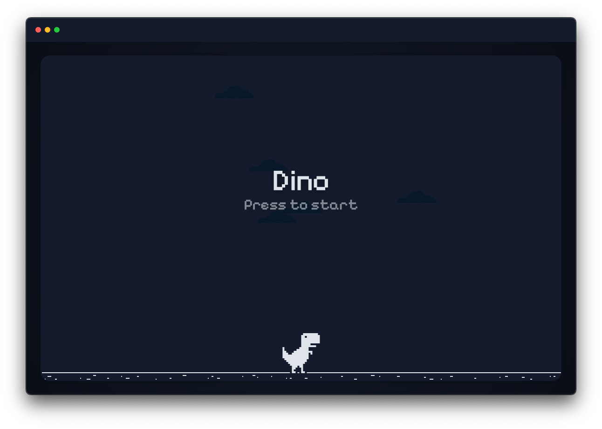
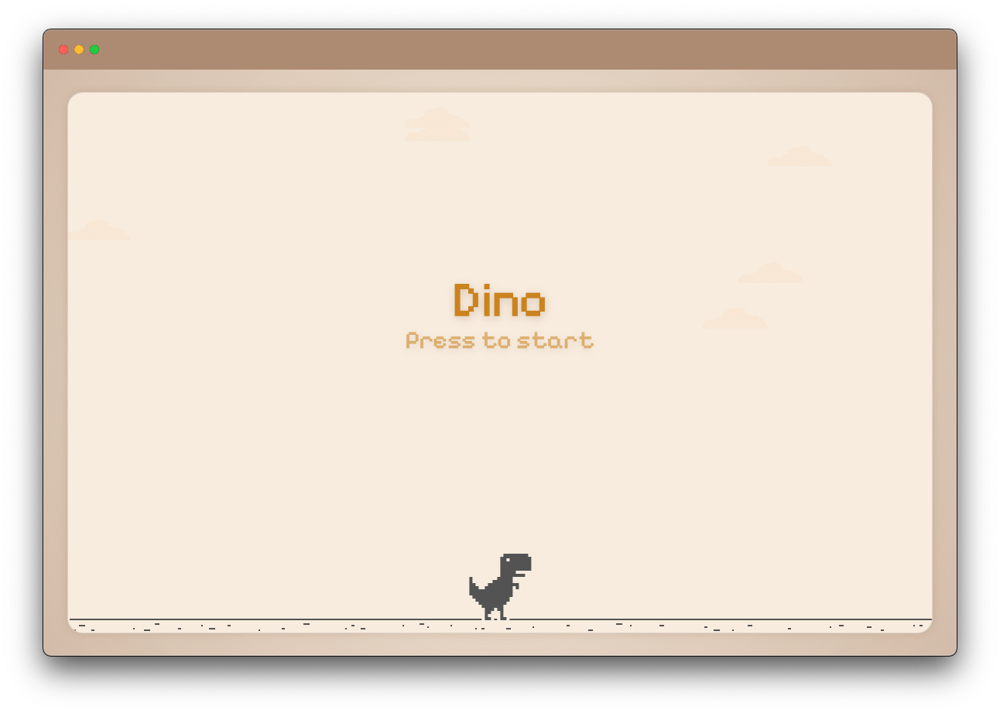

# Breakout

Typescript implementation of the [Breakout](https://en.wikipedia.org/wiki/Breakout_(video_game)) game.

    

		
        
    

	<a href="https://leandrosq.github.io/js-breakout/">Live demo here</a>

## About

This project is a simple implementation of the classic Atari Breakout game, originally made by Steve Wozniak and Steve Jobs in 1976. It was made using Typescript and the HTML5 Canvas API.
For Audio it uses the WEB Audio API, using oscillators to generate the sounds at runtime.

## How to play

Use the `mouse` or `arrow keys` to control the paddle and try to score as many points as possible.

## Used in this project

| Name | Description |
| -- | -- |
| Eslint | For linting and semantic analysis |
| Prettier | For code formatting |
| Browser sync | For live reloading |
| Esbuild | For bundling |
| gulp | For task automation |
| SASS | For CSS preprocessing |
| oklch | For color manipulation |
| Github actions | For CI, building and deploying to github pages |
| Google fonts | For the [Pixelify Sans font](https://fonts.google.com/specimen/Pixelify+Sans) |
| Google Icons | For the [Sport tennis icon](https://fonts.google.com/icons?selected=Material%20Symbols%20Outlined%3Asports_tennis%3AFILL%400%3Bwght%40400%3BGRAD%400%3Bopsz%4024) used as favicon |
| [Real favicon generator](https://realfavicongenerator.net/) | For generating the favicon |
